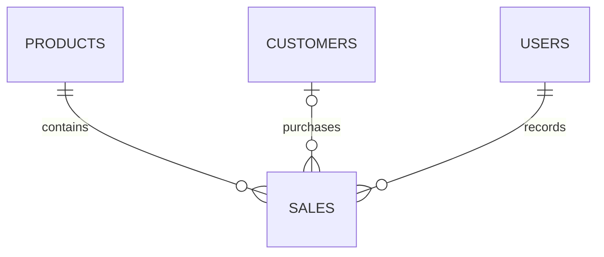

# Orbit Devices POS

A complete CodeIgniter 4 point-of-sale application for the IT0049 Midterm Project. Orbit sells phones, tablets, audio, wearables, laptops, and accessories through a responsive charcoal-and-violet staff workspace with an original orbital-device logo and nine original SVG illustrations.

## Requirements and setup

- PHP 8.2 or later with intl, mbstring, mysqli, fileinfo, gd, and SQLite3 (for tests)
- Composer 2 and MySQL 8 / MariaDB; SQLite is also supported for local previews
- Apache with mod_rewrite, or the PHP development server locally

1. Clone this repository and run `composer install`.
2. Create an empty MySQL database named `orbit_devices` using utf8mb4.
3. Copy `.env.example` to `.env`. Set the database credentials and `app.baseURL` to your URL including its trailing slash. For local development set `CI_ENVIRONMENT = development` and `app.baseURL = 'http://localhost:8080/'`.
4. Set `ORBIT_ADMIN_PASSWORD` to a unique password of 12–72 bytes. This is used only when the database has no users.
5. Run `php spark migrate` and `php spark db:seed DemoSeeder`.
6. Run `php spark serve` and open <http://localhost:8080>. Sign in as `admin` with the password you chose.

The seeder supplies nine sample products and three fictional customers. Prices and inventory are sample data for the assignment, not live retail offers. No fabricated sales are seeded. Re-running the seeder when users exist does not overwrite data or reset passwords.

For a local SQLite preview, set `database.default.DBDriver = SQLite3` and `database.default.database = orbit.sqlite`. The database is stored inside `writable/`. Run the same migration and seeder commands.

## Features and rubric coverage

| Criterion | Implementation |
| --- | --- |
| Architecture and design | Explicit routes, controllers, four models, views, an image service, a transactional sale service, migrations, and a seeder |
| Product management | Search, category filtering, pagination, add/edit, stock and price validation, image upload, and archive |
| Customer management | Add, list, search, edit, and delete; deleting a customer retains sales with a null customer reference |
| Staff management | Add, list, edit, avatar upload, hashed passwords, and delete; current staff and staff referenced by sales are protected from deletion |
| Authentication | Session login, password verification, session ID regeneration, login throttling, logout, and authentication checks on every management route |
| Record sale | Select one product, optional customer, and positive quantity; calculates the total on the server and deducts stock atomically |
| Sales history | Product, customer or walk-in, staff, quantity, total price, date/time, and reference number |
| Validation and security | Server-side validation, escaped HTML output, CSRF-protected POST forms, query builder parameter binding, constrained/re-encoded uploads, and protected image delivery |
| Documentation and deployment | Setup instructions, Dockerfile, Railway configuration, schema description, automated tests, and deployment instructions |

All authenticated staff can manage all records, matching the activity's staff-only access requirement. A user with recorded sales cannot be deleted because `sales.sold_by` is a required foreign key. Products are archived to preserve their sales history. No online payment processor is included: recording a sale records a store transaction and inventory movement.

## Schema

`app/Database/Migrations/2026-10-05-000001_CreatePos.php` defines the required `products`, `customers`, `users`, and `sales` tables. The assignment's columns and relationships are retained; `products.category` and `products.archived` support the catalog design. Money uses `DECIMAL(10,2)` on MySQL. Passwords are generated with `password_hash()` and verified with `password_verify()`.

Sales use a transaction and a conditional stock update (`stock_quantity >= requested quantity`) before recording the sale. If stock is insufficient, a customer is invalid, or insertion fails, the transaction rolls back. Prices are read from the database after the update obtains its lock; the browser cannot supply the total. MySQL deployments must use InnoDB, the default engine of MySQL 8.

Customer deletion sets `sales.customer_id` to null. Product and staff deletion are restricted by the foreign keys. History shows the current product and staff names while the transaction's quantity, total, and date remain stored.

## Images

Uploaded JPG, PNG, and WebP files are limited to 2 MB, 6000 pixels per side, and 16 megapixels. They are decoded and re-encoded as JPEG with random filenames. Products fit within 1000 × 1000; avatars are cropped to 256 × 256. Uploaded files live outside the public web root in `writable/uploads`, and authenticated `/media/{filename}` routes serve them as images. Replacing an image leaves the prior file available for backup retention; unused-file cleanup may be added for larger deployments.

The SVG logo and product illustrations are included in `public/assets`. `node build-assets.cjs` regenerates the device illustrations. Uploaded SVG files are not accepted. Product trademarks identify sample catalog items; the artwork is independently drawn. Fonts use Google Fonts with local system fallbacks.

## Routes

| Route | Purpose |
| --- | --- |
| `GET /login`, `POST /login`, `POST /logout` | Authentication |
| `GET /` | Overview |
| `GET /products`, `/customers`, `/staff` | Lists |
| `GET /{entity}/new`, `GET /{entity}/{id}/edit` | Forms |
| `POST /{entity}`, `POST /{entity}/{id}` | Create and update |
| `POST /{entity}/{id}/delete` | Delete or archive |
| `GET /sales/new`, `POST /sales` | Sale entry and recording |
| `GET /sales` | Sales history |
| `GET /media/{filename}` | Protected uploaded image |
| `GET /health` | Hosting health check |

Automatic routing is disabled. Management forms use POST; GET never deletes or changes inventory. Dates use Asia/Manila, and amounts use Philippine pesos.

## Verification

Run `php vendor/bin/phpunit`. Tests use a fresh in-memory SQLite database and never modify the store database. They cover stock deduction, monetary totals, rollback, sold-out and archived products, customer foreign keys, authentication guards, and page rendering. MySQL deployment should additionally be smoke-tested after configuration.

Manual acceptance: sign in; create/edit products, customers, and staff; upload a product image and avatar; record a sale with a customer and a walk-in sale; confirm stock decreases; attempt excessive quantity; verify sales history; archive a product; delete an unused staff account and customer; sign out and confirm management pages redirect to login. Check phone and desktop layouts.

## Hosting

See [DEPLOYMENT.md](DEPLOYMENT.md) for Railway with MySQL, Docker, persistent uploads, and a public HTTPS domain. GitHub Pages cannot execute this PHP application. Keep `.env`, databases, uploaded images, sessions, and local credentials out of Git; the supplied `.gitignore` excludes them.

The local preview and a hosted deployment use separate databases. A hosted link is ready for submission only after migrations, seeding, login, image upload, and a complete sale have been verified on that host.
